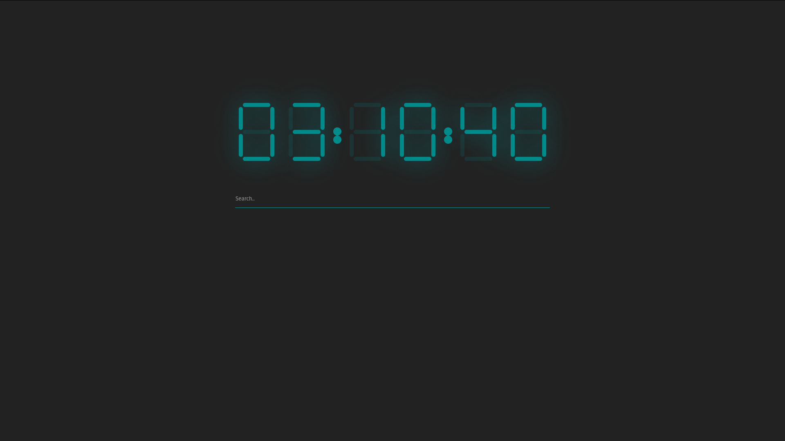

<h1 align="center">
   
  
   
  Custom Home Page
   
   
</h1>

  
  
  
  
  

I am no WebDev so I am sure a lot of this could be cleaned up so submit a pull request and lest fix it!

# Customize it

Right now I have some comments in the CSS file that let you know where the key items are to change
to fit your color needs.
